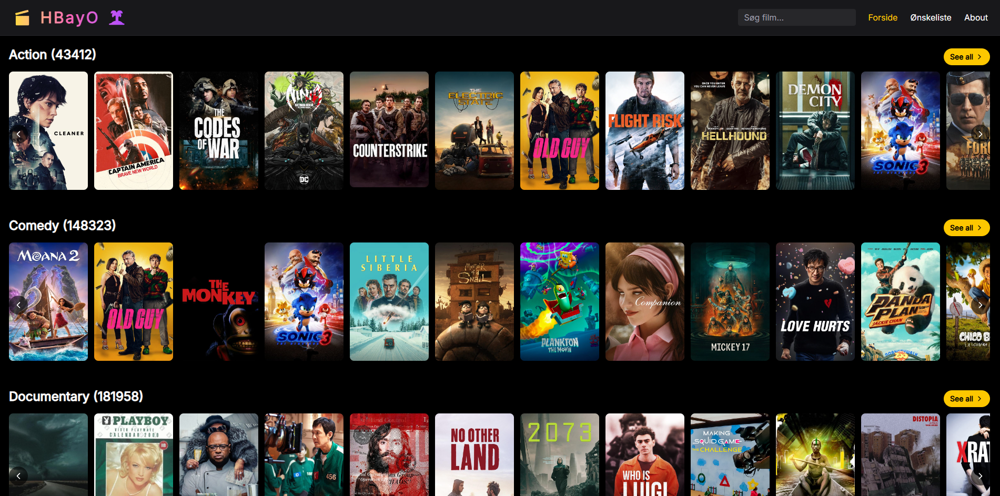
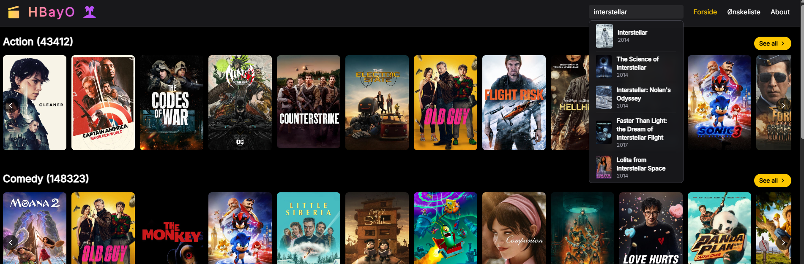
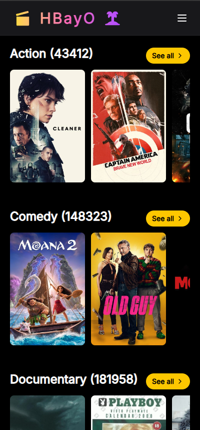
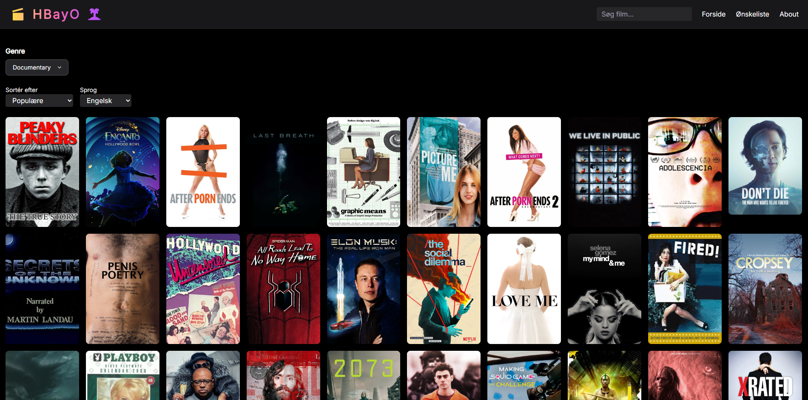
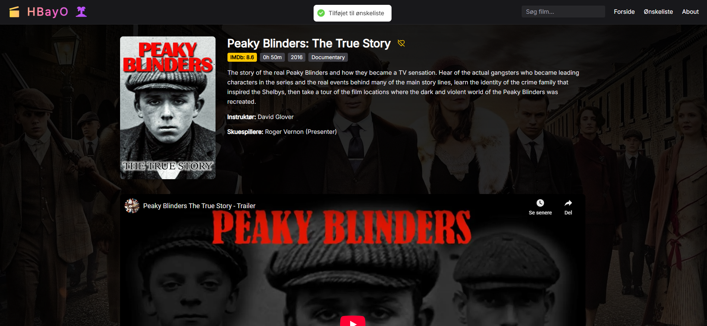
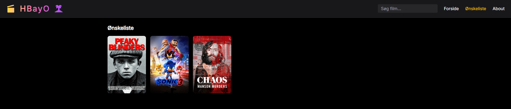

# React + Vite Movie App

## Features

- Browse film efter genre
- Søgning og filtrering
- Trailers og detaljeret info
- Hover på film med titel + imdb rating
- Fetcher film info på hover
- Ønskeliste
- Se lignende film
- Mobilvenlig med sidescroll

## Support

- Desktop (Chrome, Edge)
- Mobil

## Tech Stack

- Vite
- React
- Tailwind CSS
- TMDB REST API

## Setup

# 1. Clone repo
```bash
git clone https://github.com/Ahsm123/hbayo-movie-site.git
cd hbayo-movie-site/frontend
```
# 2. Installér dependencies
```bash
npm install
```
# 3. Opret .env fil i 'frontend'-mappen og indsæt:

```env
VITE_TMDB_READ_TOKEN=your_tmdb_read_token_here
```
Brug v4 Read Access Token fra TMDB API settings

# 4. Start dev server
```bash
npm run dev
```
## Eksempler

### Forside





### Genreside



### Detaljer




### Ønskeliste


