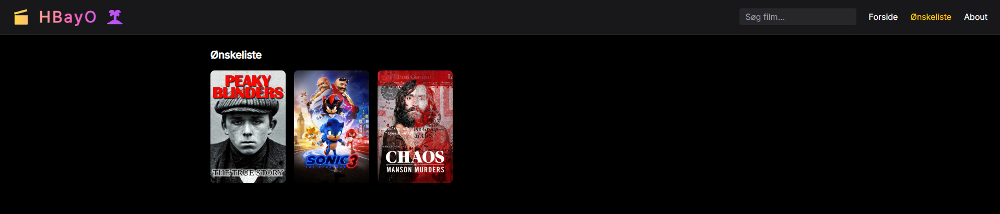

# React + Vite Movie App

## Features

- Browse film efter genre
- Søgning og filtrering
- Trailers og detaljeret info
- Ønskeliste
- Se lignende film
- Mobilvenlig med sidescroll

## Support

- Desktop (Chrome, Edge)
- Mobil

## Tech Stack

- Vite
- React
- Tailwind CSS
- TMDB REST API

## Setup

# 1. Clone repo

git clone https://github.com/Ahsm123/wexo-movie-site.git
cd wexo-movie-site

# 2. Installer dependencies i frontend folder

npm install

# 3. Lav .env fil og tilføj key

echo "VITE_TMDB_API_KEY=your_tmdb_api_key_here" > .env
brug tmdb v4 Read Access Token (Bearer token)

# 4. Start dev server

npm run dev

## Eksempler

### Forside

### Detaljer

### Ønskeliste

